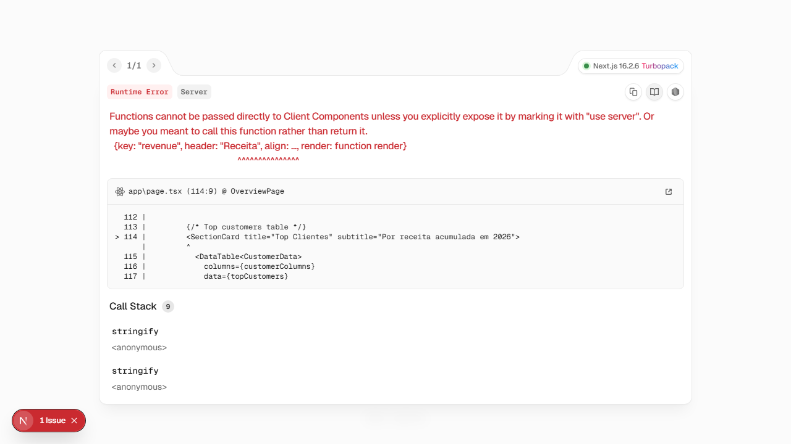
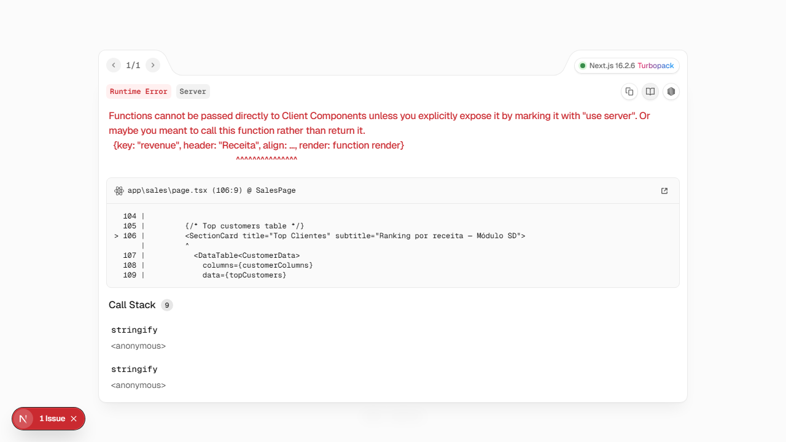
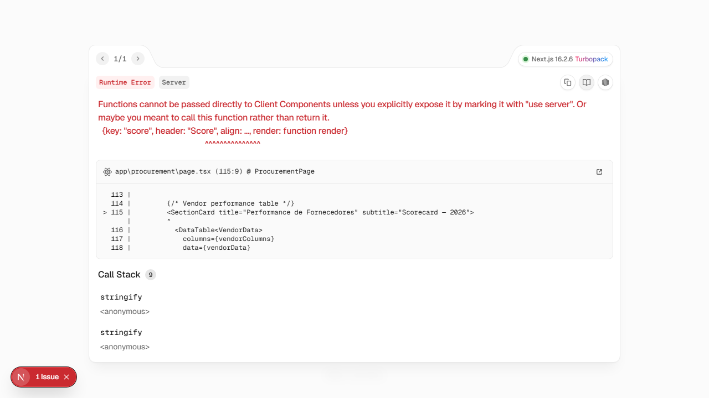
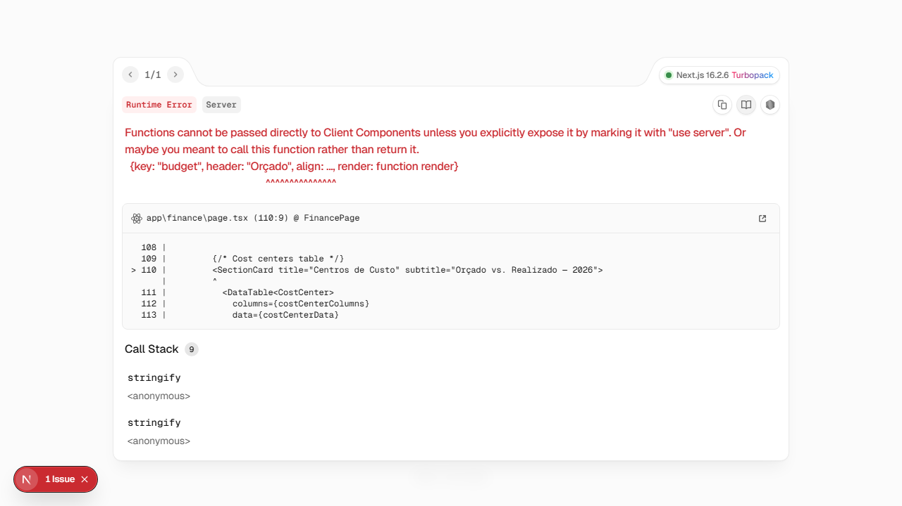

<div align="center">
  <h1>📊 SAP Analytics Dashboard</h1>
  <p>Business Intelligence dashboard inspired by SAP Analytics Cloud, built with Next.js 14 and Recharts</p>

  
  
  
  
  
</div>

## 📸 Screenshots

<div align="center">
  
  <p><em>Overview — KPIs, revenue trend e spend breakdown</em></p>
</div>

<table>
  <tr>
    <td><br/><em>Sales & Distribution (SD)</em></td>
    <td><br/><em>Procurement (MM)</em></td>
    <td><br/><em>Finance (FI)</em></td>
  </tr>
</table>

## ✨ Features
- 📈 **Sales Analytics (SD Module)** — Revenue trends, regional performance, customer ranking
- 🛒 **Procurement Analytics (MM Module)** — PO volume, vendor scorecard, spend-by-category
- 💰 **Finance Analytics (FI Module)** — P&L overview, budget vs. actual, cost-center drill-down
- 🎯 **KPI Cards** — Real-time metrics with MoM trend indicators
- 📊 **Interactive Charts** — Area, bar, pie, and composed charts (Recharts)
- 🌑 **Dark UI** — Professional SAP-inspired glassmorphism design
- 📱 **Responsive** — Works on desktop and tablets

## 🛠️ Tech Stack
| Technology | Purpose |
|---|---|
| Next.js 14 (App Router) | Full-stack React framework |
| TypeScript | Type safety |
| Tailwind CSS | Utility-first styling |
| Recharts | Data visualisation |
| Lucide React | Icon library |

## 🚀 Getting Started

```bash
git clone https://github.com/TargaryenAG/sap-analytics-dashboard.git
cd sap-analytics-dashboard
npm install
npm run dev
```
Open [http://localhost:3000](http://localhost:3000)

## 📁 Project Structure
```
app/
├── page.tsx               # Overview dashboard
├── sales/page.tsx         # SD — Sales analytics
├── procurement/page.tsx   # MM — Procurement analytics
└── finance/page.tsx       # FI — Finance analytics
components/
├── layout/                # Sidebar & Header
├── ui/                    # KPI cards, tables
└── charts/                # Recharts wrappers
lib/
└── mockData.ts            # Mock SAP data (BRL, BR companies)
```

## 📊 SAP Modules
| Module | Code | Coverage |
|---|---|---|
| Sales & Distribution | SD | Revenue, customers, regions |
| Materials Management | MM | POs, vendors, spend |
| Financial Accounting | FI | P&L, budget, cost centers |

## 📄 License
MIT © Nathan Andrade
